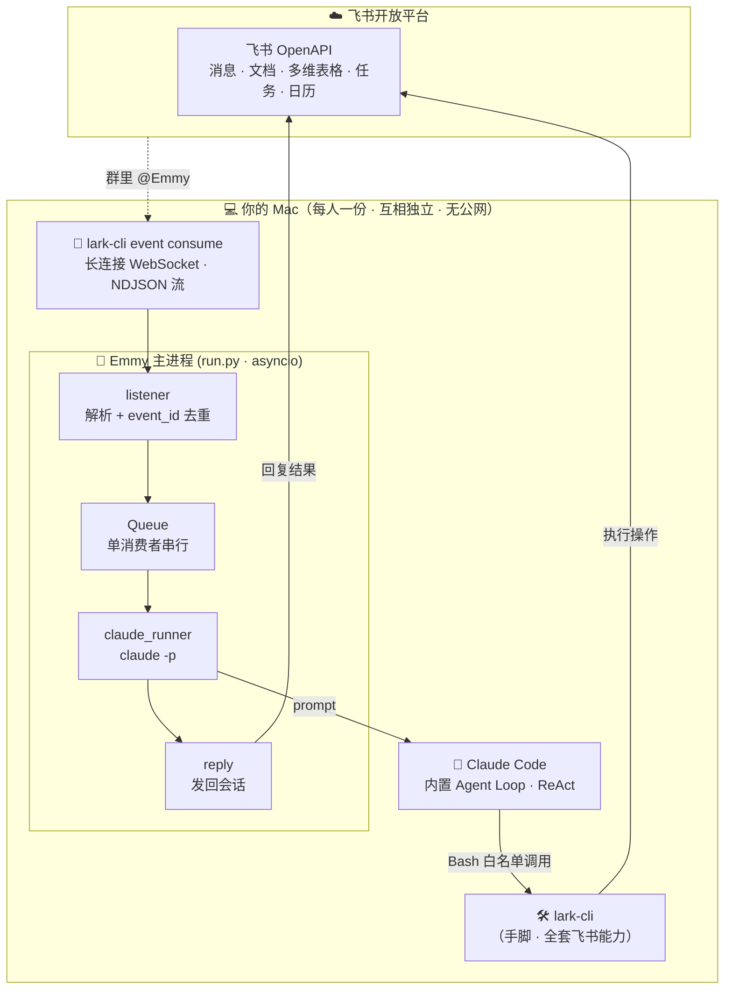
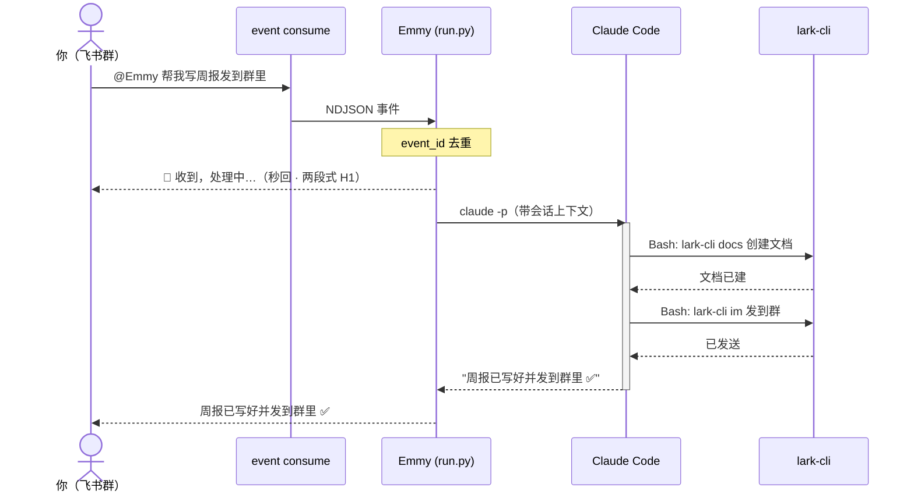

<div align="center">

# Emmy 🦊

### 你自己的飞书 AI 智能体 —— 让 `lark-cli` 和 `Claude Code` 两个强工具协作干活


*在飞书里 `@Emmy` 说一句话，她就帮你写文档、发通知、记多维表格、建任务……*
*大脑用你本机的 **Claude Code**，手脚用 **lark-cli**——不配 API Key、不要服务器、不开公网。*

</div>

---

## 这是什么

**Emmy 不是再造一个机器人，而是把两个已经很强的工具「焊」在一起：**

- 🧠 **Claude Code** 当**大脑**——自带 ReAct agent loop、工具调用、会话记忆，免配 LLM。
- 🛠️ **lark-cli**（`@larksuite/cli`）当**手脚**——飞书全套能力（消息 / 文档 / 多维表格 / 任务 / 知识库 / 日历…）。

本质是**把 lark-cli 培养成一个真正的 agent，底座是 Claude Code**。每位同事在自己的 Mac 上 `git clone` + `./init.sh`，就拥有一个**专属于自己**、用自己飞书身份和 Claude 订阅干活的智能体，数据与凭证只在本机。

---

## 🏗️ 架构一图流



> 飞书事件经 `lark-cli event consume` 的**本地长连接**流进来（无需公网 IP / Webhook / 暴露端口）；
> Emmy 把消息交给 Claude Code，由它**自主**用 Bash 调 lark-cli 干活，最后把结果发回原会话。

---

## ⚡ 一条消息怎么跑通



**关键设计**：先秒回「处理中」让你知道收到了（Claude 干活可能要几十秒）；`event_id` 去重防飞书超时重推导致的重复回复；同一会话用确定性 `--session-id` 续聊。

---

## 🚀 能干什么

Emmy 的能力 = lark-cli 的能力，**说人话就行**：

| 能力 | 在飞书 @Emmy 这样说 |
|------|-------------------|
| 📝 文档写作 / 整理 | “帮我写本周技术周报” |
| 💬 消息通知 | “通知项目群：部署已完成” |
| 📊 多维表格 (Bitable) | “把今天的数据记进 Bitable” |
| ✅ 项目任务 | “建个任务：修复登录 bug，截止周五” |
| 📚 知识库 (Wiki) | “把这份文档归档到知识库” |
| 📅 日历 | “下周一下午 3 点约个会” |

> 覆盖范围随 lark-cli 全覆盖：`im / docs / base / task / wiki / calendar / drive / sheets …`

---

## 🌱 不止于此：可扩展愿景

Emmy 设计成**稳定薄引擎 + 可插拔能力层**——通过补充 **Agent skills / command** 不断长本事，**加能力不用改引擎**。终极目标是编排跨能力的复杂工作流，比如这条「北极星用例」：


> 飞书侧的活（拉群 / 收集 / 整理 / 分类）Emmy 自己干；「自动修复」是把整理好的任务**移交给代码仓库里的另一个 Claude Code agent**——一个管飞书、一个管代码，各司其职。

---

## 💡 为什么这么设计

| 亮点 | 说明 |
|------|------|
| **不配 LLM** | 大脑直接复用本机已登录的 Claude Code，省掉 API Key、provider 配置、自写 agent loop |
| **不要服务器** | 飞书事件走 `lark-cli` 本地长连接，**无公网 / 无 Webhook / 无端口** |
| **clone 即用** | `./init.sh` 一键体检装环境，`lark-cli` 引导创建智能体（`auth status` 检测到已有则复用） |
| **人人独立** | 每人一个飞书 app、一份本机实例、各自凭证会话，无多租户复杂度 |
| **安全护栏** | `--permission-mode dontAsk` + `--allowedTools 'Bash(lark-cli:*)'`，高危命令显式挡掉 |

---

## 📂 项目结构

> ✅ = 已实现并自测通过　🚧 = 路线图

```
emmy/
├── init.sh                  ✅ 体检环境 + auth status 检测/复用飞书智能体
├── run.py                   ✅ 主循环：监听 → 单消费者队列 → claude → 回复（两段式 + supervisor 重启）
├── core/
│   ├── listener.py          ✅ event consume 长连接 + NDJSON 解析 + event_id 去重
│   ├── claude_runner.py     ✅ claude -p 调用 + 确定性 session 续聊 + 权限护栏 + 认证 heartbeat
│   └── reply.py             ✅ lark-cli im 发回原会话 + 幂等防重发
│
├── prompts/emmy_system.md   🚧 Emmy 人设 + lark-cli 能力清单
├── start.sh                 🚧 launchd 后台守护（登录即起 / 崩溃自愈）
├── (skills / command)       🚧 可扩展能力层
│
├── README.md · QUICKSTART.md · ONBOARDING.md   📖 文档体系
├── PRD.md · 计划书.md                            📖 产品需求 + 完整技术方案
└── .gitignore
```

每个核心模块都带**自测**，直接跑即可验证：

```bash
python3 core/listener.py        # ✓ 解析 / 去重 / 脏数据健壮
python3 core/claude_runner.py   # ✓ 命令构造 / 结果解析 / session 派生
python3 core/reply.py           # ✓ 发消息命令构造
```

---

## 🛠️ 快速开始

```bash
# ① 克隆
git clone https://github.com/EchoWangBiz/Emmy.git emmy && cd emmy

# ② 一键体检 + 装环境 + 引导配置
./init.sh

# ③ 起 Emmy（端到端跑通需先：claude 登录 + 飞书 app 配好收消息）
python3 run.py
```

详细步骤 👉 **[QUICKSTART.md](QUICKSTART.md)**　·　飞书 app 怎么配 👉 **[ONBOARDING.md](ONBOARDING.md)**

### 环境要求

- **macOS**（Apple Silicon / Intel，`init.sh` 用 `$(brew --prefix)` 自适应）
- 一个 **Claude 订阅**（Pro/Max，当大脑）
- 一个**飞书账号**（`init` 用 `lark-cli config init --new` 引导创建智能体，已有则复用）
- 其余依赖（Homebrew / Node / Claude Code / lark-cli / Python 3.12）`./init.sh` 帮你装

---

## 📊 当前状态 & 路线图

**现在到哪了**：MVP 主链路代码全部搭好、各模块自测通过；端到端验证待两个前提——① 本机 `claude` 登录　② 飞书 app 配好能收 @消息。

已规划的硬化方向（按优先级）：

| 优先 | 方向 | 内容 |
|:---:|------|------|
| 🔴 | **H3 安全** | 受控包装层 + 高危操作（删除/群发）二次确认 |
| 🔴 | **H1 体验** | 两段式响应 ✅ + 流式进展 + 模型分级 |
| 🟠 | **H4 认证** | 强制 setup-token + heartbeat 预检 + 失效独立告警 |
| 🟠 | **H5 质量** | 装 lark agent skills + 收敛高频能力面 |
| 🟡 | **H7 上手** | `init` 交互式向导自动处理飞书配置时序坑 |
| 🟡 | **H6 稳定** | consume supervisor ✅ + launchd KeepAlive |
| ⚪ | **H2 在线** | 诚实定位"工位助手" + `caffeinate` 防睡眠 |

> 完整设计、技术选型与风险分析见 **[计划书.md](计划书.md)**。

---

## 📚 文档导航

| 文档 | 内容 |
|------|------|
| [QUICKSTART.md](QUICKSTART.md) | 最短上手路径：三步 + 前置清单 + 验证 + FAQ |
| [ONBOARDING.md](ONBOARDING.md) | 飞书 app 建应用全流程（机器人 / 权限 / 长连接订阅 / 发布 / 拉群） |
| [PRD.md](PRD.md) | 产品需求文档（目标 / 功能 / 非功能 / 验收标准） |
| [计划书.md](计划书.md) | 完整架构设计、技术方案与风险评估 |

---

<div align="center">

🔒 *Emmy 是内部工具，凭证与会话仅存于你本机（macOS Keychain + `~/.claude/`），不入库、不上传。*

</div>
