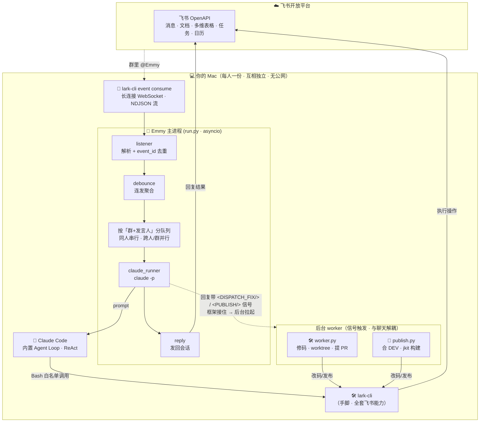
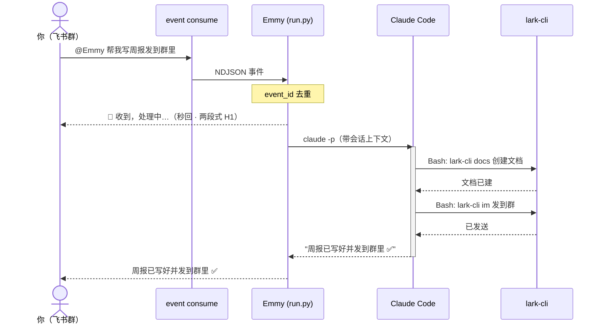

<div align="center">

# Emmy 🦊

### 你自己的飞书 AI 智能体 —— 让 `lark-cli` 和 `Claude Code` 两个强工具协作干活


*在飞书里 `@Emmy` 说一句话，她就帮你写文档、发通知、记多维表格、建任务……*
*更进一步：在「修 BUG 群」里 `@Emmy` 一句「把这些 BUG 修了」，她**整理工单 → 派代码侧自动改码提 PR → 修好 @你验收 → 一句「发布」自动合 DEV 构建**，全程不用你碰代码。*
*大脑用你本机的 **Claude Code**，手脚用 **lark-cli**——不配 API Key、不要服务器、不开公网。*

</div>

---

## 这是什么

**Emmy 不是再造一个机器人，而是把两个已经很强的工具「焊」在一起：**

- 🧠 **Claude Code** 当**大脑**——自带 ReAct agent loop、工具调用、会话记忆，免配 LLM。
- 🛠️ **lark-cli**（`@larksuite/cli`）当**手脚**——飞书全套能力（消息 / 文档 / 多维表格 / 任务 / 知识库 / 日历…）。

本质是**把 lark-cli 培养成一个真正的 agent，底座是 Claude Code**。每位同事在自己的 Mac 上 `git clone` + `./init.sh`，就拥有一个**专属于自己**、用自己飞书身份和 Claude 订阅干活的智能体，数据与凭证只在本机。

---

## 🏗️ 架构一图流



> 飞书事件经 `lark-cli event consume` 的**本地长连接**流进来（无需公网 IP / Webhook / 暴露端口）；
> Emmy 把消息交给 Claude Code，由它**自主**用 Bash 调 lark-cli 干活，最后把结果发回原会话。
> 重活（改代码、发布）不卡聊天——Emmy 只在回复里吐一个**对用户不可见的信号**，框架接住后**后台**拉起 `worker.py` / `publish.py` 干，干完回群通知。

---

## ⚡ 一条消息怎么跑通



**关键设计**：先秒回「处理中」让你知道收到了（Claude 干活可能要几十秒）；`event_id` 去重防飞书超时重推导致的重复回复；同一会话用确定性 `--session-id` 续聊。

---

## 🚀 能干什么

### 🌟 旗舰能力：内测 BUG 全自动闭环（已落地）

在一个「修 BUG 群」里，从**收 BUG** 到**改好上线**，Emmy 把整条流水线串起来——你只动嘴：


- **一句话派工**：`@Emmy 把群里信息齐的 BUG 都修了` → 她读多维表格、挑出信息齐的、批量标「待修复」，后台 worker 自动**逐条**改码提 PR，修好**挨个 @提问人**验收。
- **大脑绝不碰代码**：Emmy（飞书侧）只管「识别 + 派工 + 通知 + 状态流转」；真正改代码是**另一个 Claude Code**（代码侧 worker），两者**只通过多维表格通信**。每个 BUG 在独立 **git worktree** 改，互不干扰，**只提 PR、绝不合主干**。
- **拿不准会停下来问**：worker 改不动 / 风险高 → 不硬改，把疑问写进表里「待确认问题」+ @提问人；你把答复填回表，**下一轮自动接着修**。PR 被 review 打回同理——填回意见，worker 在**原分支**续改、更新原 PR。
- **8 态状态机**（多维表格是唯一事实源）：
  `待处理 → 待修复 → 修复中 →(拿不准)待人工确认 → 待发布 → 待验收 → 已验收 / 不修`
- **一句话发布**：`@Emmy 发布 / 上 dev`（或 `部署前端`）→ 后台 publish worker 把「待发布」的 bugfix **合进 DEV、push、`jkit` 触发 Jenkins 构建**，成功转「待验收」+ 群通知。这是**唯一被允许 push dev** 的受控环节，绝不碰 `main`、冲突即停、绝不 force。

> 详见能力定义 [`prompts/abilities/bug-triage.md`](prompts/abilities/bug-triage.md) 与代码侧 [`core/worker.py`](core/worker.py)、[`core/publish.py`](core/publish.py)。

### 🧰 通用飞书能力（说人话就行）

Emmy 的能力 = lark-cli 的能力：

| 能力 | 在飞书 @Emmy 这样说 |
|------|-------------------|
| 📝 文档写作 / 整理 | “帮我写本周技术周报” |
| 💬 消息通知 | “通知项目群：部署已完成” |
| 📊 多维表格 (Bitable) | “把今天的数据记进 Bitable” |
| ✅ 项目任务 | “建个任务：修复登录 bug，截止周五” |
| 📚 知识库 (Wiki) | “把这份文档归档到知识库” |
| 📅 日历 | “下周一下午 3 点约个会” |

> 覆盖范围随 lark-cli 全覆盖：`im / docs / base / task / wiki / calendar / drive / sheets …`

### 💬 私聊 = 纯编程对话助手

私聊（p2p）@Emmy 时她自动切成**精简模式**——就是个靠谱的 Claude Code 对话助手，问代码、出主意、查问题都行，**群里那套 BUG 工单/状态流转流程不会被误触发**。

### 🌱 稳定薄引擎 + 可插拔能力层

Emmy 设计成**稳定薄引擎 + 可插拔能力层**：能力都写在 `prompts/abilities/*.md`，主进程启动时自动拼进 system prompt——**加能力 = 放个 `.md`，不用改引擎代码**。目前已内置：BUG 工单闭环（`bug-triage`）、多维表格「工作流」守护（`base-automation`）。

---

## 💡 为什么这么设计

| 亮点 | 说明 |
|------|------|
| **不配 LLM** | 大脑直接复用本机已登录的 Claude Code，省掉 API Key、provider 配置、自写 agent loop |
| **不要服务器** | 飞书事件走 `lark-cli` 本地长连接，**无公网 / 无 Webhook / 无端口** |
| **clone 即用** | `./init.sh` 一键体检装环境，`lark-cli` 引导创建智能体（`auth status` 检测到已有则复用） |
| **入群即配** | 新群首次 @Emmy 走「配置门禁」——对话式问全（干啥 / BUG 表链接 / 代码路径），框架自动写 `emmy.yaml` 并标记完成，**基本不用手填配置** |
| **权限分离·大脑不碰危险动作** | Emmy 大脑**没有写文件、改代码、push 的权限**，只在回复里吐 `<EMMY_CONFIG>` / `<DISPATCH_FIX/>` / `<PUBLISH/>` 等**对用户不可见的信号**；落盘、改码、合 DEV 这些危险动作全在**确定性框架代码**里，参数硬编码，不让模型自由发挥 |
| **重活不卡聊天** | 改代码 / 发布丢给**后台子进程**（`worker.py` / `publish.py`），主进程只管对话和派工，干完回群通知 |
| **人人独立** | 每人一个飞书 app、一份本机实例、各自凭证会话，无多租户复杂度 |
| **安全护栏** | `--permission-mode dontAsk` + `--allowedTools 'Bash(emmy-lark:*)'`，`emmy-lark` 白名单包装把高危命令显式挡掉；单实例 `flock` 锁防重复监听、`event_id` 去重防重复回复 |

---

## 📂 项目结构

> ✅ = 已实现　🚧 = 路线图

```
emmy/
├── init.sh                  ✅ 一键体检环境 + auth status 检测/复用飞书智能体
├── start.sh                 ✅ 启停控制台：fg / start / stop / restart / status / logs（launchd 常驻）
├── run.py                   ✅ 主进程：监听 → 防抖聚合 → 按「群+发言人」分队列 → claude → 回复
│                                两段式回复 + 配置门禁 + 派工/发布信号接住 + 单实例锁 + supervisor 重启
├── core/
│   ├── listener.py          ✅ event consume 长连接 + NDJSON 解析 + @判定
│   ├── claude_runner.py     ✅ claude -p 调用 + 确定性 session 续聊 + 权限护栏
│   ├── reply.py             ✅ lark-cli im 发回原会话 + 幂等防重发
│   ├── attachments.py       ✅ 下载并读出文本类附件，注入给 Emmy
│   ├── config.py            ✅ 读/写 emmy.yaml（群角色 + 资源绑定；受控写入）
│   ├── repo_locate.py       ✅ 按 BUG「所属模块」路由到对应代码仓库
│   ├── lark_gate.py         ✅ lark-cli 调用网关 / 权限收口
│   ├── worker.py            ✅ 后台修复 worker：扫表 → worktree 改码 → 提 PR → 回写状态 → @提问人
│   └── publish.py           ✅ 后台发布 worker：合 DEV + push + jkit 构建（唯一可碰 dev 的受控环节）
│
├── prompts/
│   ├── emmy_system.example.md       ✅ Emmy 人设模板（复制成 emmy_system.md 生效）
│   └── abilities/                   ✅ 可插拔能力层（启动时自动拼进 system prompt）
│       ├── bug-triage.md            ✅ BUG 工单闭环（状态机 / 派工 / 发布 / 验收）
│       └── base-automation.md       ✅ 多维表格「工作流」守护
├── bin/emmy-lark            ✅ lark-cli 白名单包装（挡高危命令）
├── .claude/skills/git-workflow      ✅ 两阶段 git 提交规范
│
├── docs/bug-fix-workflow.md         📖 BUG 闭环设计稿
├── README.md · QUICKSTART.md · ONBOARDING.md   📖 文档体系
├── PRD.md · 计划书.md                            📖 产品需求 + 完整技术方案
└── emmy.yaml.example · .gitignore
```

多数核心模块带**内置自测**，直接跑即可验证：

```bash
python3 core/config.py          # ✓ emmy.yaml 解析 / 写读往返 / 合并
python3 core/claude_runner.py   # ✓ 命令构造 / 结果解析 / session 派生
python3 core/listener.py        # ✓ 解析 / @判定 / 脏数据健壮
python3 core/reply.py           # ✓ 发消息命令构造
```

---

## 🛠️ 快速开始

```bash
# ① 克隆
git clone https://github.com/EchoWangBiz/Emmy.git emmy && cd emmy

# ② 一键体检 + 装环境 + 引导配置
./init.sh

# ③ 起 Emmy（端到端跑通需先：claude 登录 + 飞书 app 配好收消息）
./start.sh fg      # 前台调试，看实时日志、Ctrl-C 退出
# 或 ./start.sh start   # launchd 后台常驻、开机自启

# 可选：启动时选择大脑适配器
./start.sh fg --brain claude
./start.sh fg --brain codex
./start.sh start --brain codex --model gpt-5.4
```

> 起来后把机器人拉进群、@它即可。**新群**首次 @ 会触发「配置门禁」——Emmy 会对话式带你把这个群配好（干啥 / BUG 表链接 / 代码仓库路径），配好自动写进 `emmy.yaml`，以后不再问。

详细步骤 👉 **[QUICKSTART.md](QUICKSTART.md)**　·　飞书 app 怎么配 👉 **[ONBOARDING.md](ONBOARDING.md)**

### 环境要求

- **macOS**（Apple Silicon / Intel，`init.sh` 用 `$(brew --prefix)` 自适应）
- 一个 **Claude 订阅**（Pro/Max，当大脑）
- 一个**飞书账号**（`init` 用 `lark-cli config init --new` 引导创建智能体，已有则复用）
- 其余依赖（Homebrew / Node / Claude Code / lark-cli / Python 3.12）`./init.sh` 帮你装

---

## 📊 当前状态 & 路线图

**现在到哪了**：主链路 + **内测 BUG 全自动闭环**（整理工单 → 派工改码提 PR → @验收 → 自动发布到 DEV）已落地并跑通；配置门禁、私聊模式、附件读取、并发调度、单实例锁、supervisor 重启、launchd 常驻均已实现。端到端运行需两个前提——① 本机 `claude` 登录　② 飞书 app 配好能收 @消息。

| 状态 | 方向 | 内容 |
|:---:|------|------|
| ✅ | **核心闭环** | BUG 工单（8 态状态机）+ worktree 改码提 PR + 自动发布到 DEV（jkit/Jenkins） |
| ✅ | **H1 体验** | 两段式响应 + 队列播报（报实际排队情况） |
| ✅ | **H3 安全** | `emmy-lark` 白名单包装 + 大脑/危险动作权限分离 + 受控发布环节 |
| ✅ | **H6 稳定** | consume supervisor 重启 + launchd KeepAlive + 单实例 flock 锁 |
| 🟠 | **H4 认证** | 强制 setup-token + heartbeat 预检 + 失效独立告警 |
| 🟠 | **H5 质量** | 装 lark agent skills + 收敛高频能力面 |
| 🟡 | **更多角色** | 当前能力角色 `fix-bug`；规划 `daily-report` 等更多群角色 |
| 🟡 | **高危二次确认** | 批量改状态 / 删记录 / 群发的显式确认（目前靠人设约束「先问一声」） |
| ⚪ | **H2 在线** | 诚实定位"工位助手" + `caffeinate` 防睡眠 |

> 完整设计、技术选型与风险分析见 **[计划书.md](计划书.md)**。

---

## 📚 文档导航

| 文档 | 内容 |
|------|------|
| [QUICKSTART.md](QUICKSTART.md) | 最短上手路径：三步 + 前置清单 + 验证 + FAQ |
| [ONBOARDING.md](ONBOARDING.md) | 飞书 app 建应用全流程（机器人 / 权限 / 长连接订阅 / 发布 / 拉群） |
| [PRD.md](PRD.md) | 产品需求文档（目标 / 功能 / 非功能 / 验收标准） |
| [计划书.md](计划书.md) | 完整架构设计、技术方案与风险评估 |

---

<div align="center">

🔒 *Emmy 是内部工具，凭证与会话仅存于你本机（macOS Keychain + `~/.claude/`），不入库、不上传。*

</div>
